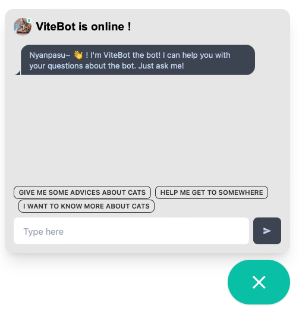

# Chatbot Embeddable Client

A simple, lightweight chatbot client built with the Svelte JavaScript framework. Easily embeddable on any website.

<p align="center"></p>

## Features

- Responsive design for desktop and mobile devices
- Customizable style and branding
- User input validation
- Full-featured chatbot functionality

## Getting Started

1. Add the following script and link tag to the head of your HTML file:

```html

<script id="ibentau-chatbot-script" async type="module" crossorigin
        src="https://github.com/Ibentau/front-client/releases/download/VERSION/ibentau.js"></script>
<link rel="stylesheet" href="https://github.com/Ibentau/front-client/releases/download/VERSION/style.css">
```

2. Add the following script tag at the end of your HTML file:

```html

<script>
  document.querySelector('#ibentau-chatbot-script').addEventListener('load', function() {
    new ChatBot({
      target: document.body,
      props: {
        botName: 'ViteBot',
      },
    });
  });
</script>
```

## License

This project is licensed under the Apache License 2.0 - see the [LICENSE](LICENSE) file for details.
